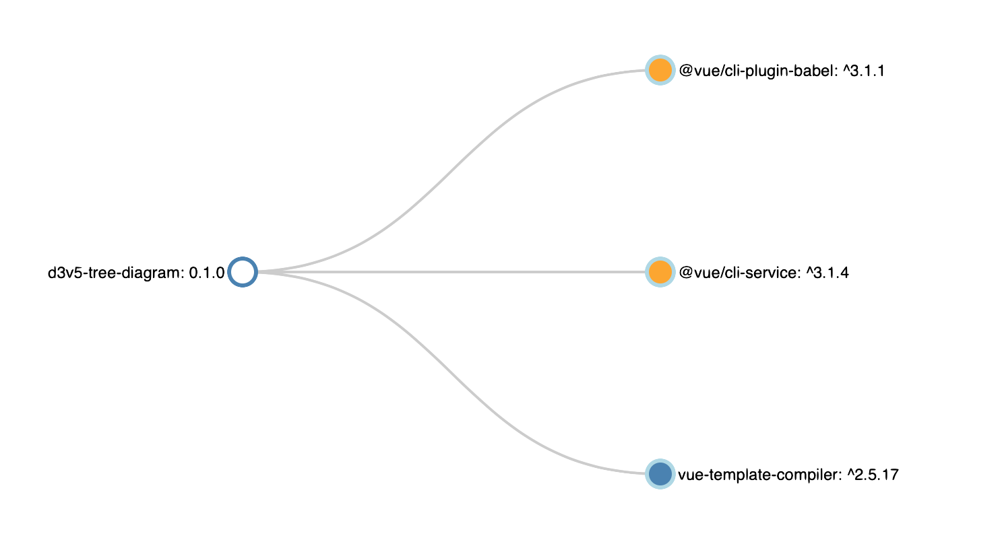
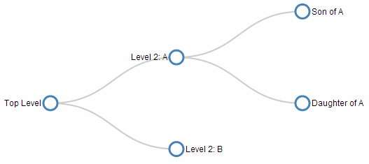

# d3v5-tree-diagram


The main goal is to read the package.json file of the project and draw the dependencies as a tree.

### References
Three Little Circles

Once upon a time, there were three little circles.
https://bost.ocks.org/mike/circles/

## Project setup
```
npm install
```

### Compiles and hot-reloads for development
```
npm run serve
```

### Compiles and minifies for production
```
npm run build
```

### Run your tests
```
npm run test
```

### Lints and fixes files
```
npm run lint
```

### Customize configuration
See [Configuration Reference](https://cli.vuejs.org/config/).


